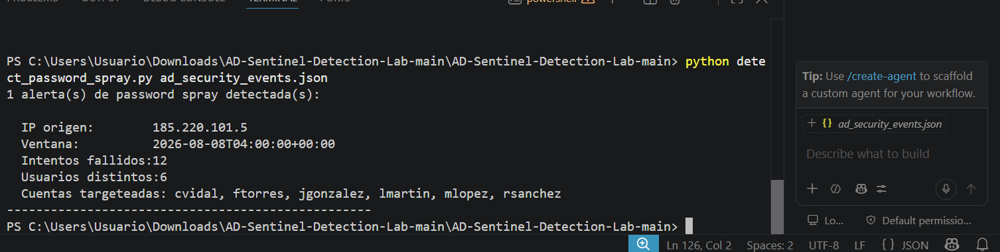

# 🛡️ AD Sentinel Detection Lab

Laboratorio de práctica para detectar y responder a un ataque de **password spraying** contra Active Directory, con la lógica de detección escrita en KQL (pensada para Microsoft Sentinel) y validada localmente con Python.

> ⚠️ **Nota de alcance:** este es un proyecto de laboratorio/aprendizaje. La query KQL está escrita para correr contra la tabla `SecurityEvent` de un Log Analytics Workspace real en Microsoft Sentinel. Armar la infraestructura de ingesta custom (Data Collection Endpoint / Data Collection Rule) resultó desproporcionado para el alcance de este lab, así que la lógica de detección fue validada localmente con un script en Python equivalente, corriendo sobre el dataset simulado. El script de respuesta (`disable_ad_user.py`) también es una simulación: imprime los comandos que ejecutaría, no realiza cambios sobre un Active Directory real.

---

## 📌 Overview

- **Objetivo:** simular el flujo completo de un analista SOC ante un ataque de password spraying: detectar, triagear y responder.
- **Qué NO es:** no es un pentest, no es una integración productiva con AD real, no es una herramienta lista para producción.
- **Qué SÍ es:** evidencia de que entiendo el flujo de detección basado en logs de Windows, sé escribir y leer queries KQL, y puedo razonar sobre una respuesta a incidente.

---

## 🏗️ Arquitectura / Flujo

Logs de AD (Security Event Log, simulados en JSON)
│ (Eventos 4625 / 4624)
▼
Lógica de detección
├── Query KQL (queries/detect_failed_logins.kql.txt) → pensada para Sentinel
└── Script Python (detect_password_spray.py) → misma lógica, validada localmente
│
▼
Alerta: IP origen, usuarios targeteados, cantidad de intentos
│
▼
Script de respuesta (disable_ad_user.py) — SIMULADO


---

## 🎯 Escenario simulado

Un atacante intenta autenticarse con una lista de usuarios comunes usando una única contraseña débil repetida (password spraying), buscando evitar el bloqueo por intentos fallidos que dispara un ataque de fuerza bruta tradicional dirigido a una sola cuenta.

**Indicadores buscados:**
- Múltiples eventos `4625` (fallo de logon) para **distintos usuarios** desde el **mismo origen** en una ventana corta de tiempo.
- Baja tasa de éxito por usuario (a diferencia de un ataque dirigido a una sola cuenta).

**Dataset (`ad_security_events.json`):** incluye un escenario de ataque simulado: 6 usuarios distintos (`jgonzalez`, `mlopez`, `rsanchez`, `cvidal`, `ftorres`, `lmartin`), 2 intentos fallidos cada uno, todos desde la IP `185.220.101.5` en una ventana de pocos minutos — 12 intentos fallidos en total, superando el umbral de detección.

---

## 🔍 Detection Logic (KQL)

```kql
SecurityEvent
| where EventID == 4625
| where TimeGenerated > ago(1h)
| extend SourceIP = IpAddress
| summarize 
    FailedAttempts = count(),
    DistinctUsers = dcount(TargetUserName),
    TargetedAccounts = make_set(TargetUserName, 20)
    by SourceIP, bin(TimeGenerated, 10m)
| where DistinctUsers >= 5 and FailedAttempts >= 10
| order by FailedAttempts desc
```

**Por qué esta query:**
- `EventID == 4625`: fallo de autenticación en Windows Security Log — el evento que registra cada intento fallido de logon.
- `dcount(TargetUserName)`: lo que distingue un password spray de un ataque de fuerza bruta clásico es que apunta a **muchos usuarios**, no a uno solo repetidas veces.
- `bin(TimeGenerated, 10m)`: agrupa en ventanas de 10 minutos para detectar ráfagas de actividad, no fallos aislados a lo largo del día.
- `DistinctUsers >= 5 and FailedAttempts >= 10`: umbral de detección. Son valores de ejemplo para el lab — en un entorno real se ajustan según el ruido normal (baseline) de la organización, para evitar falsos positivos por usuarios que simplemente se equivocan de contraseña.

---

## 🐍 Validación local (Python)

Como alternativa a levantar la infraestructura completa de Sentinel para este lab, `detect_password_spray.py` replica exactamente la misma lógica de la query KQL en Python, corriendo contra el dataset JSON local.

```bash
python detect_password_spray.py ad_security_events.json
```

### Evidencia



1 alerta(s) de password spray detectada(s):

IP origen: 185.220.101.5
Ventana: 2026-08-08T04:00:00+00:00
Intentos fallidos: 12
Usuarios distintos: 6
Cuentas targeteadas: cvidal, ftorres, jgonzalez, lmartin, mlopez, rsanchez


La lógica detecta correctamente el patrón de password spray y descarta actividad normal (fallos aislados de un solo usuario no disparan alerta).

---


## 🐍 Script de respuesta — `disable_ad_user.py`

Simula las acciones que tomaría un analista tras confirmar el incidente:
- Deshabilitar la cuenta comprometida (`Disable-ADAccount`)
- Revocar tokens de sesión activos (`Revoke-AzureADUserAllRefreshToken`)

**⚠️ Importante:** este script **imprime** los comandos que se ejecutarían — no se conecta a un Active Directory real ni ejecuta cambios. Es una simulación pensada para mostrar el razonamiento de respuesta a incidente.

```bash
python disable_ad_user.py
```

---

## 📚 Lessons Learned

- Escribir la lógica de detección dos veces (KQL y Python) ayudó a entender mejor qué hace cada cláusula de la query, en vez de solo copiarla.
- El umbral de detección importa tanto como la lógica: un umbral muy bajo (`FailedAttempts >= 2` en una versión inicial) genera falsos positivos con actividad normal.
- Armar infraestructura cloud completa (DCE/DCR/App Registration) para un lab de aprendizaje puede consumir mucho más tiempo del que aporta — a veces vale más priorizar validar la lógica que completar cada pieza de la arquitectura ideal.

---

## 🛠️ Stack

- KQL (Kusto Query Language) — pensado para Microsoft Sentinel / Log Analytics
- Python 3.x
- JSON como formato de dataset simulado

---

## 📂 Estructura del repo

.
├── readme.md
├── disable_ad_user.py
├── detect_password_spray.py
├── ad_security_events.json # dataset simulado, incluye el escenario de ataque
├── deteccion_local.png # evidencia de la detección corriendo
└── queries/
└── detect_failed_logins.kql.txt
